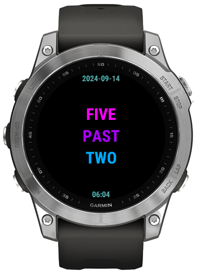
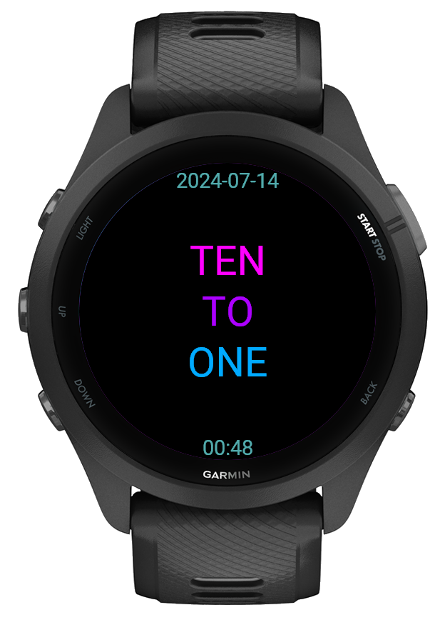
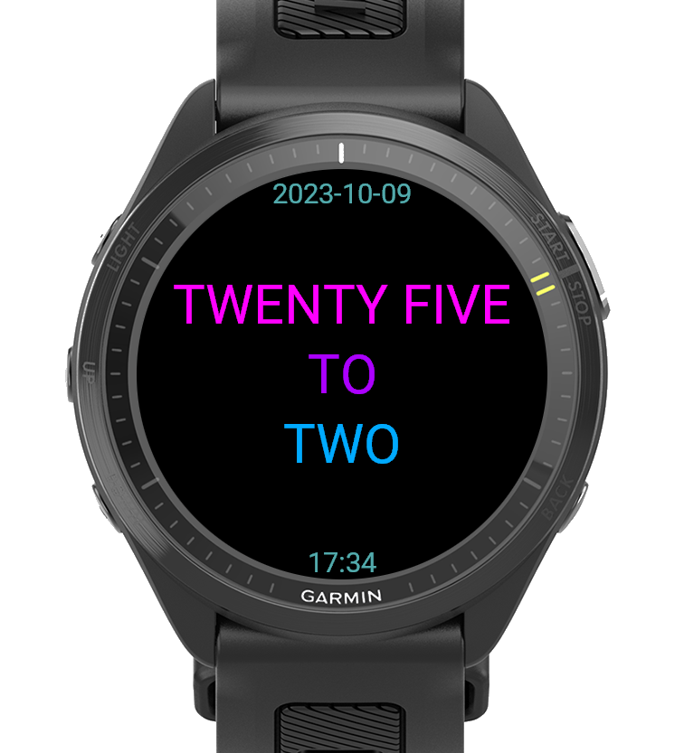
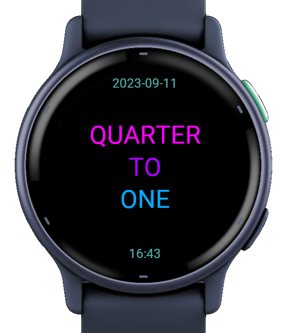

# Fuzzy Time Garmin Watch Face

A minimalist watch face for Garmin devices that displays time in natural language.

## Features

- 🕐 **Fuzzy time display** - Shows time rounded to the nearest 5 minutes in words
- 🎨 **Colorful design** - Different colors for hours, minutes, and connectors
- 📅 **Date and time** - Shows current date (YYYY-MM-DD) and digital time at top/bottom
- 📱 **Multi-device support** - Responsive layout for various Garmin models
- ⚡ **Lightweight** - Minimal battery impact

## Screenshots

| Fenix 7 | FR265 | FR970 | Vivoactive 6 |
|:-------:|:-----:|:-----:|:------------:|
|  |  |  |  |

## Supported Devices

- Fenix 5/6/7 series (including S/X variants)
- Forerunner 245, 255, 265, 645, 745, 935, 945, 955, 970
- Vivoactive 4/4S/6
- and probably others

## Installation

### From Source

1. Install [Connect IQ SDK](https://developer.garmin.com/connect-iq/sdk/)
2. Clone this repository
3. Compile:
   ```bash
   monkeyc -o FuzzyTime.prg -f monkey.jungle -y /path/to/developer_key.der
   ```
4. Copy `FuzzyTime.prg` to `GARMIN/APPS/` on your watch

## How It Works

The watch face converts the current time to natural language:

- **4:00** → `FOUR O'CLOCK`
- **4:15** → `QUARTER PAST FOUR`
- **4:30** → `HALF PAST FOUR`
- **4:45** → `QUARTER TO FIVE`
- **4:52** → `TEN TO FIVE` (rounds to nearest 5 minutes)

## Color Scheme

- **Hour** (e.g., "FOUR"): Cyan (`0x00aaff`)
- **Minute** (e.g., "HALF"): Magenta (`0xff00ff`)
- **Connector** (e.g., "PAST"): Purple (`0xaa00ff`)
- **Date/Time**: Teal (`0x55aaaa`)

## Development

```bash
# Build
monkeyc -o FuzzyTime.prg -f monkey.jungle -y developer_key.der -d fr945 -w

# Test in simulator
monkeydo FuzzyTime.prg fr945
```

## Background & Credits

I've been using a custom watch face called "Fuzzy Time" on my trusted Garmin Forerunner 945 for years. When time came to upgrade to a new model, I realized that the watch face wasn't available in the Garmin app store anymore, and I also couldn't find it anywhere else online.

I didn't like any of the alternatives, so I built a clone of the original version from scratch 🥳

If you know any details about the original design, please let me know, and I will credit the author!